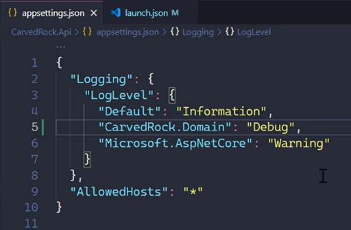

# Using Log Levels and applying filters

## Intro

## Intention of application Loging

> What to Do and what Don't

## Log Levels Defined  

1. Trace (Not Prod) 
> Used in low level diagnostic if we are really having troubles resolving complex issues. Some of this msges might contain sensitive data

2. Debug (Might be temporary in Prod)
> Volume of data is very high as well, use it counscious. 

3. Information
> Using for general flow of the app. Have in some key places can be helpfull 

4. Warning
> Used for abnormal or unexpected events. Generally things triggering this events don't cause a clear fauilure in the app.

5. Error
> Something that cause a failure in the app, the failure can be specific to th user/situation.

6. Critical
> Critical entry should be created under errors that are not specifics to users or situations:
- been out of disk space
- db being completely unavailable 
- Something reflects the complete app is down

## Demo: Using Log Levels

## Categories Defined

> Log Category

## Log Filters

> Applying filters

App Settings

Env Variables

### Demo- Filtering based on Providers

setting the debug provider pathh

ie:

### Applying filters in code

## Summary

