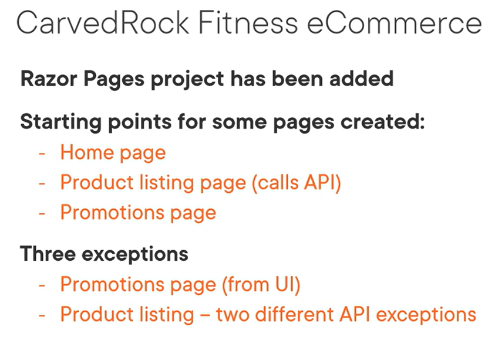
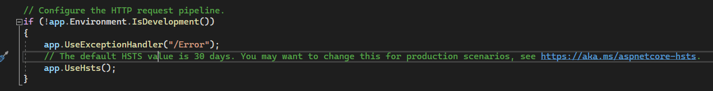
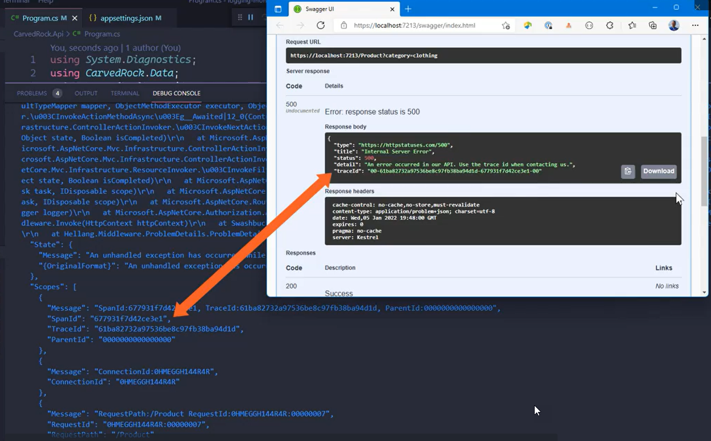
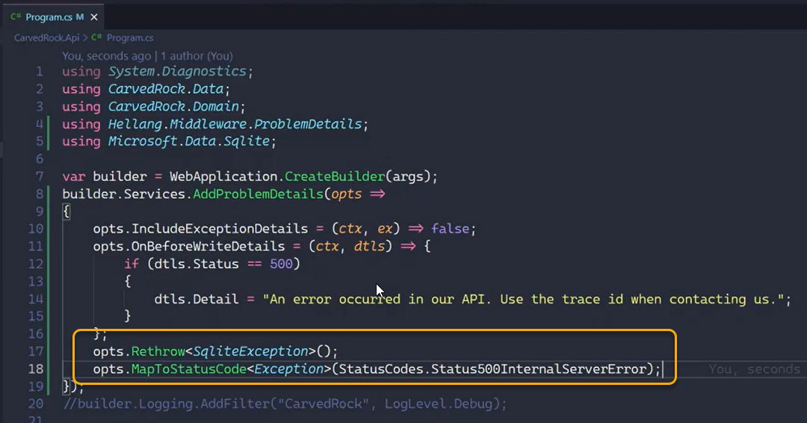
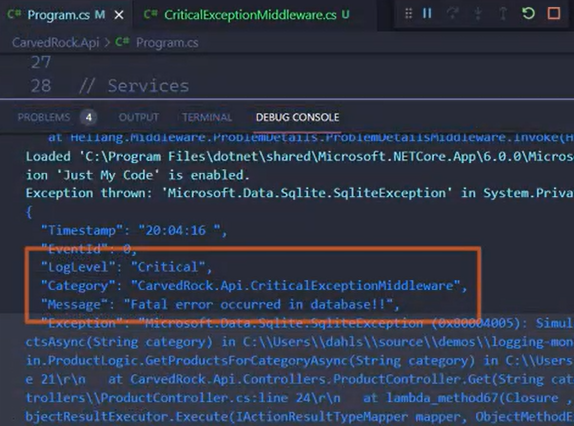

# Exception Handling and Request Logging

## Intro


## Application Updates and Problem statements



## Exception Handling


Specific situations to add a Try/Catch


or swallowing the exception and continuing


## Demo: Using the Error Page in a User Interface




> Commenting above code condition (when not development) to execute in all environment

and removing the **appsetting.Development.json** 


For requestId
```csharp
[ResponseCache(Duration = 0, Location = ResponseCacheLocation.None, NoStore = true)]
    [IgnoreAntiforgeryToken]
    public class ErrorModel : PageModel
    {
        public string? RequestId { get; set; }
        public Activity? CurrentActivity { get; set; }
        public string TraceId { get; set; }

        public bool ShowRequestId => !string.IsNullOrEmpty(RequestId);

        private readonly ILogger<ErrorModel> _logger;

        public ErrorModel(ILogger<ErrorModel> logger)
        {
            _logger = logger;
        }

        public void OnGet()
        {
            RequestId = Activity.Current?.Id ?? HttpContext.TraceIdentifier;
            CurrentActivity = Activity.Current;
            TraceId = HttpContext.TraceIdentifier;
        }
    }
}
```


We include Scopes = true stating we should include previos IDs in the logs


Then we can see the values :


Then we can see on the scopes :


---

## Api Error Handling 


Demo:


Using the Hellang PD Middleware :


To hide exception details , maybe good on Dev Environments:


Trying the console provider:


then we get :


We can customize :


Then we get:


TraceId:



> There are situations to handle speicific critic errors , we can do:



We can have :

```csharp
using Microsoft.Data.Sqlite;

namespace CarvedRock.Api;
public class CriticalExceptionMiddleware
{
    private readonly RequestDelegate _next;
    private readonly ILogger<CriticalExceptionMiddleware> _logger;

    public CriticalExceptionMiddleware(RequestDelegate next, ILogger<CriticalExceptionMiddleware> logger)
    {
        _next = next;
        _logger = logger;
    }

    public async Task InvokeAsync(HttpContext context)
    {
        try
        {
            await _next(context);
        }
        catch (SqliteException sqlex)
        {
            if (sqlex.SqliteErrorCode == 551)
            {
                _logger.LogCritical(sqlex, "Fatal error occurred in database!!");
            }            
        }       
    }
}
```


Then we have 2 errors been logged :



and the general Middleware:


## Reading API error on the user interface


Changing Log configs


> TraceId is equal for the API and UI side, but the SpanId different:


---

## Request Logging
> This allows to create a Log entry at the conclusion of every Http Request


### Demo- Using Http and W3C Logging

For HttpLogging:


We need to be specific:


For W3C


---

## Summary


