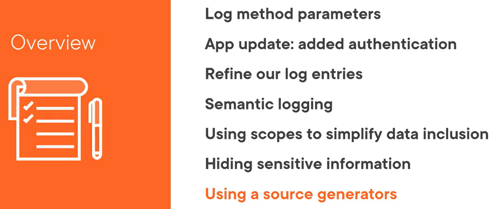
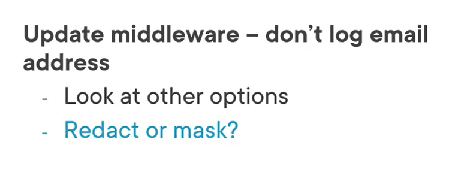

# Including and Excluding Information

## Intro



## Log Method Arguments


> There is a Log method we can pass also the LogLevel

### EventID

EventId not required, used under thoughts


### Message and MEssage Args


## Demo: Add UserInfo to log entry


For Authentication use the package :  
  
```csharp
<PackageReference Include="Microsoft.AspNetCore.Authentication.OpenIdConnect" Version="6.0.1" />
```

the code for auth in UI project:

```csharp
var builder = WebApplication.CreateBuilder(args);

JwtSecurityTokenHandler.DefaultMapInboundClaims = false;
builder.Services.AddAuthentication(options =>
{
    options.DefaultScheme = "Cookies";
    options.DefaultChallengeScheme = "oidc";
})
.AddCookie("Cookies")
.AddOpenIdConnect("oidc", options =>
{
    options.Authority = "https://demo.duendesoftware.com";
    options.ClientId = "interactive.confidential";
    options.ClientSecret = "secret";
    options.ResponseType = "code";
    options.Scope.Add("openid");
    options.Scope.Add("profile");
    options.Scope.Add("email");
    options.Scope.Add("api");
    options.Scope.Add("offline_access");
    options.GetClaimsFromUserInfoEndpoint = true;
    options.TokenValidationParameters = new TokenValidationParameters
    {
        NameClaimType = "email"
    };
    options.SaveTokens = true;
});
builder.Services.AddHttpContextAccessor();
```

the code for auth in API project:

packages:
```csharp
<PackageReference Include="IdentityModel" Version="6.0.0" />
 <PackageReference Include="Microsoft.AspNetCore.Authentication.JwtBearer" Version="6.0.1" />
```

code to auth API
```csharp
JwtSecurityTokenHandler.DefaultMapInboundClaims = false;
builder.Services.AddAuthentication("Bearer")
    .AddJwtBearer("Bearer", options =>
    {
        options.Authority = "https://demo.duendesoftware.com";
        options.Audience = "api";
        options.TokenValidationParameters = new TokenValidationParameters
        {
            NameClaimType = "email"
        };
    });
```


---

## Semantic Logging


## Log Scopes


Change the formatter name for console from "simple" to "json"


Scope Info in the controller:


Info about user better to be put in a superior level , like middleware to be shared with every component. ScopeUser must be moved.


So it gets like this:


### User Scope Midleware 

```csharp
public class UserScopeMiddleware
{
    private readonly RequestDelegate _next;
    private readonly ILogger<UserScopeMiddleware> _logger;

    public UserScopeMiddleware(RequestDelegate next, ILogger<UserScopeMiddleware> logger)
    {
        _next = next;
        _logger = logger;
    }

    public async Task InvokeAsync(HttpContext context)
    {
        if (context.User.Identity is { IsAuthenticated: true })
        {
            var user = context.User;
            var pattern = @"(?<=[\w]{1})[\w-\._\+%]*(?=[\w]{1}@)";
            var maskedUsername = Regex.Replace(user.Identity.Name??"", pattern, m => new string('*', m.Length));

            var subjectId = user.Claims.First(c=> c.Type == "sub")?.Value;
                        
            using (_logger.BeginScope("User:{user}, SubjectId:{subject}", maskedUsername, subjectId))
            {
                await _next(context);    
            }
        }
        else
        {
            await _next(context);
        }
    }
}
```


## Hidding Sensitive Information


Demo:


To mask an email see below code:


The masked val
ue looks like below:


## Demo Using LoggerMessage Source Generator


Using the [LoggerMessage] source generator in the controller:


In the UI with arguments for the scope


Actually params must match:


## Summary


