# Log Destinations

## Intro

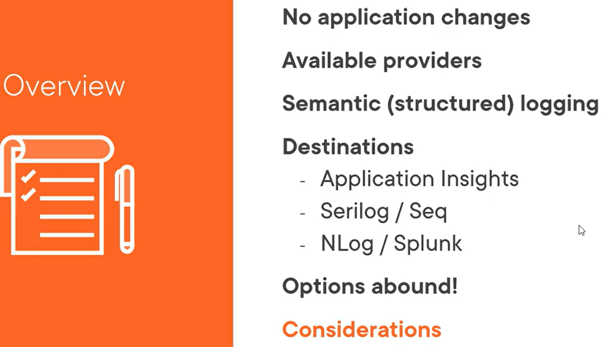

## Logging Providers

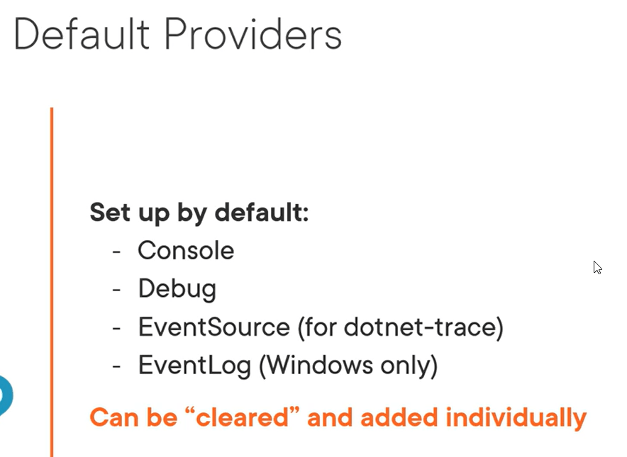

## Demo: Using Specific Providers

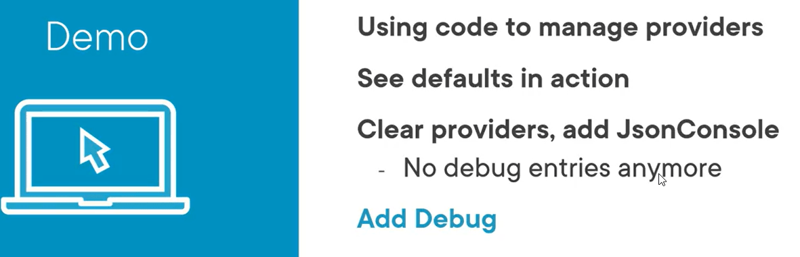

Below both providers by default :

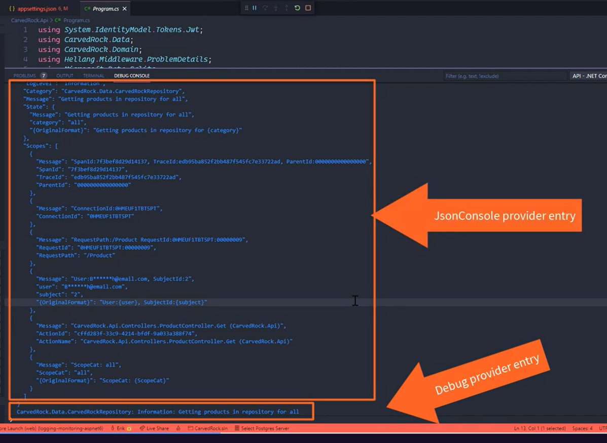

Clearing providers and available :
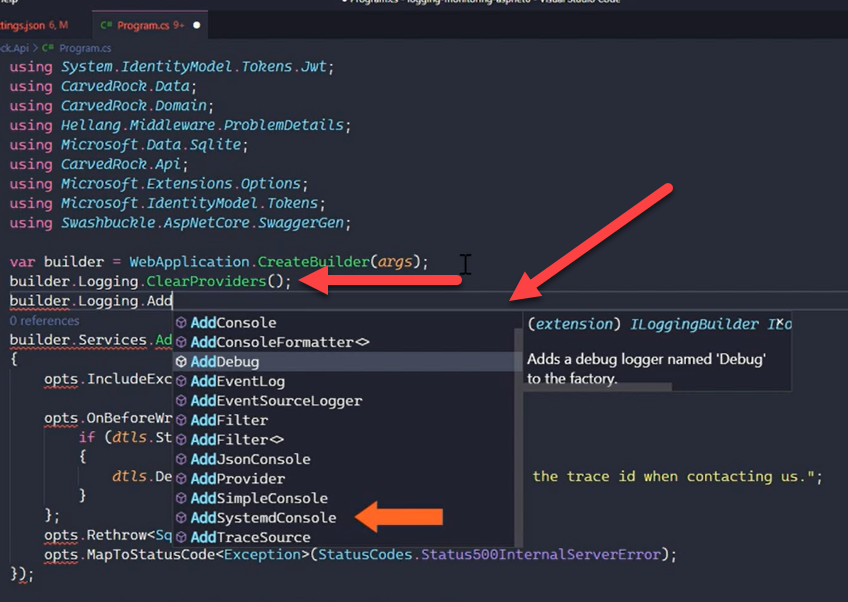

## Semantinc Logging and Destination

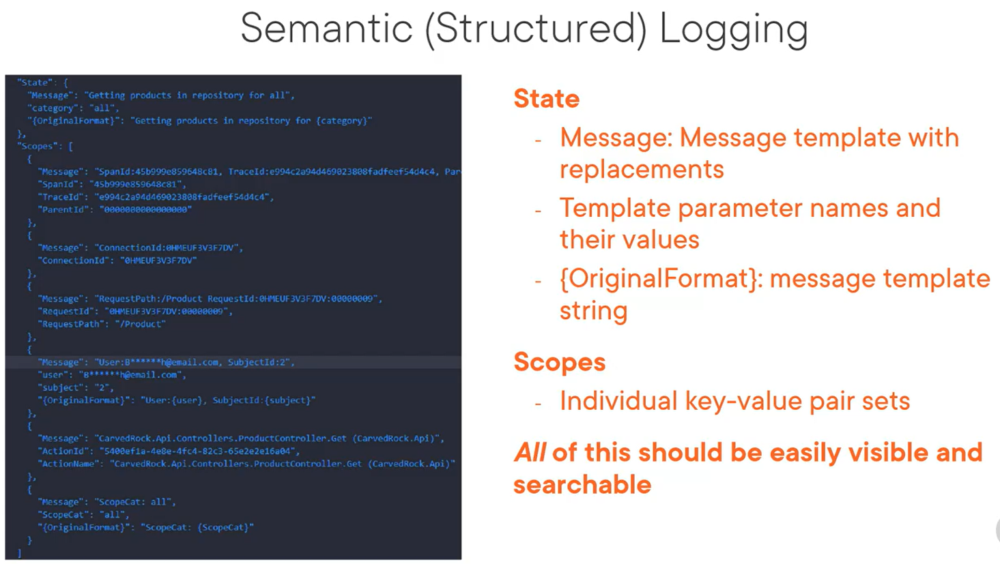

### Log Destinations

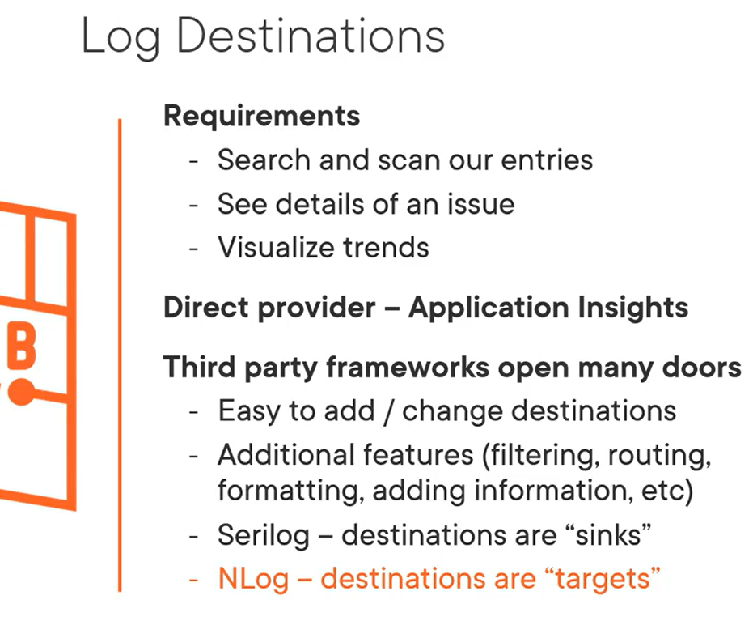

Third party logging frameworks

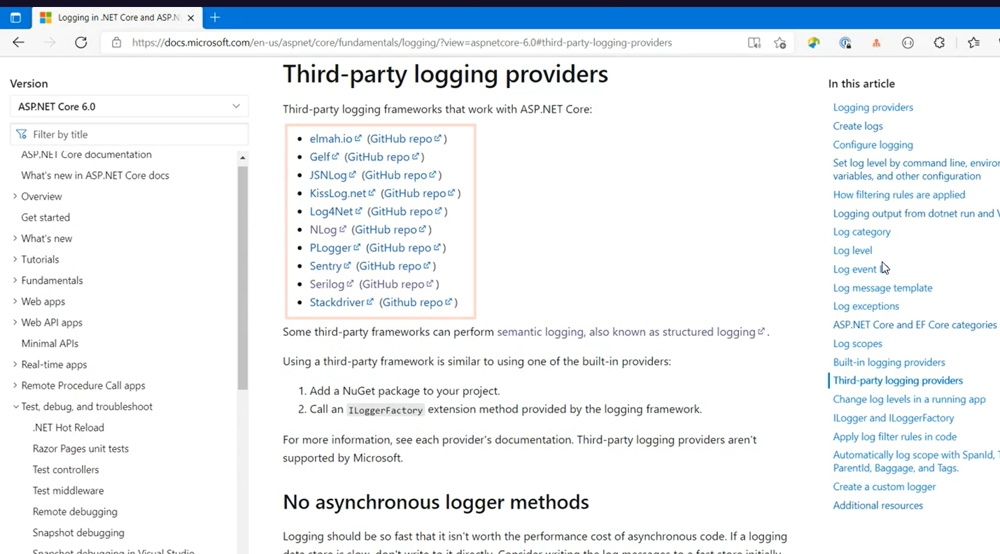

#### Popular Destinations

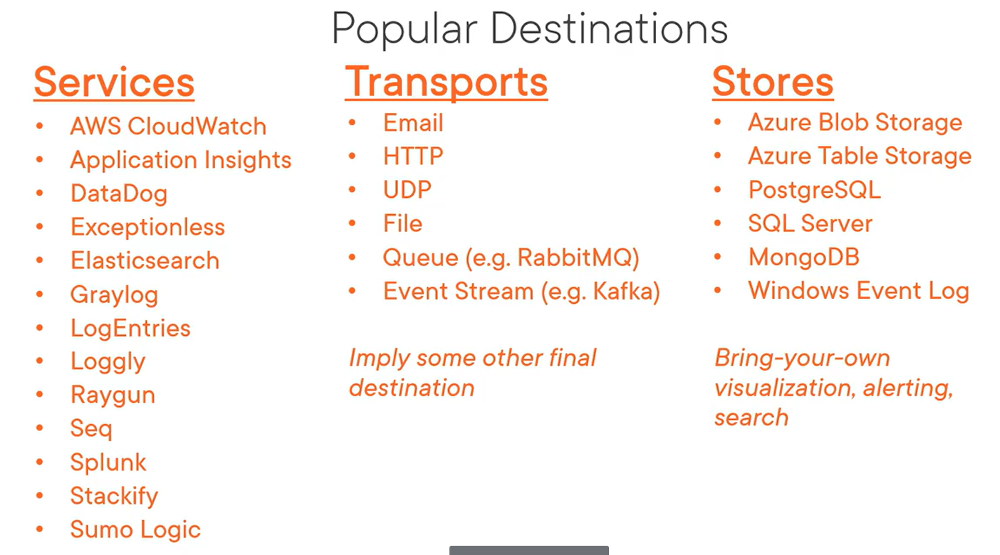

### Demo: AppInsights as Destination

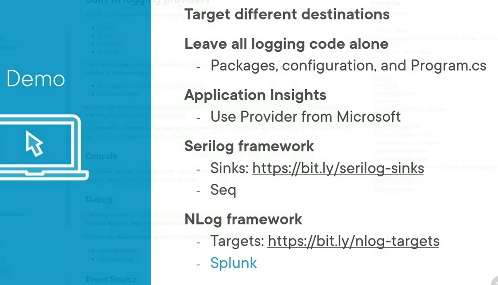

[
Azure Application Insights](
https://learn.microsoft.com/en-us/aspnet/core/fundamentals/logging/?view=aspnetcore-7.0#azure-application-insights)

For app insight and Seq with Serilog:

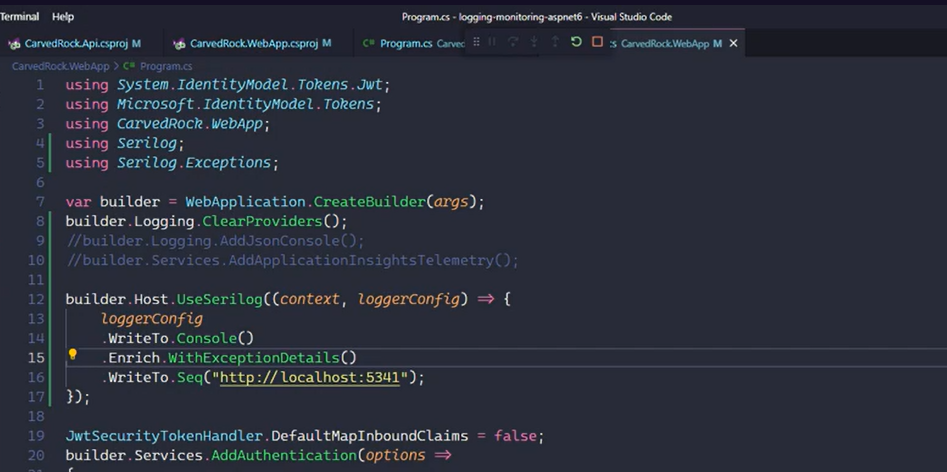

## Factor when choosing a Destination
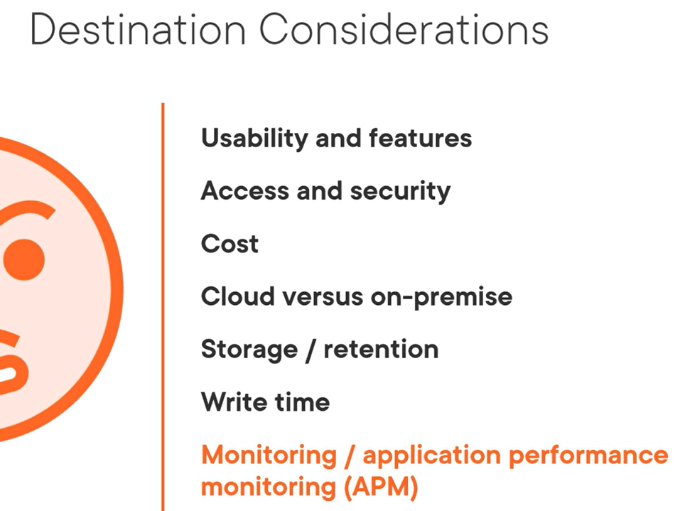

---

## Summary

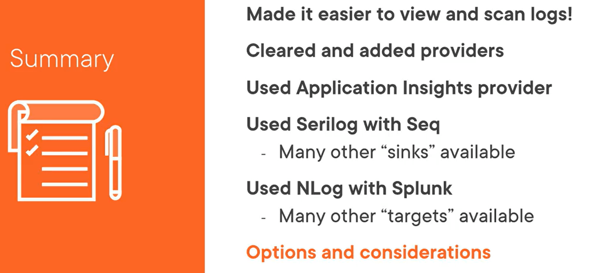

