# Enabling Monitoring

## Intro

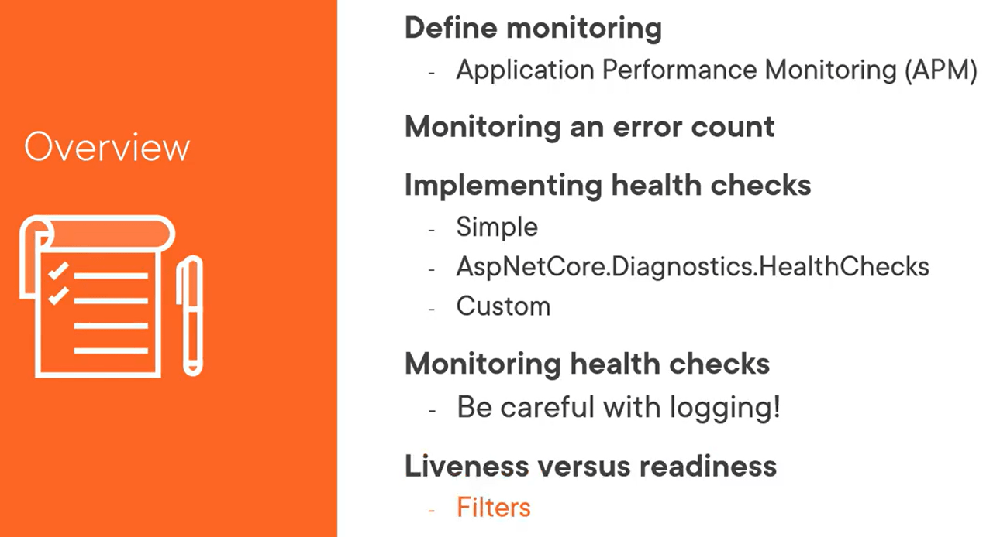

## Defining Monitoring And APM

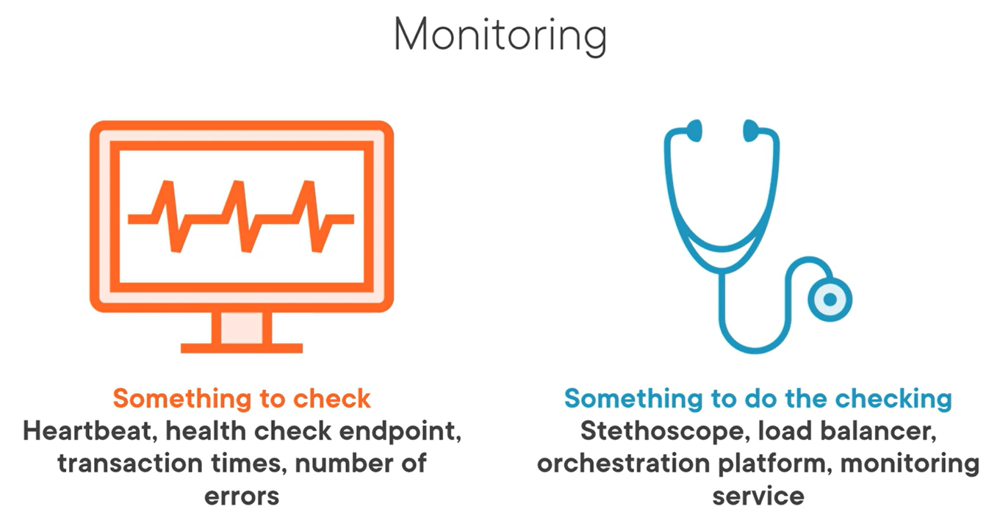

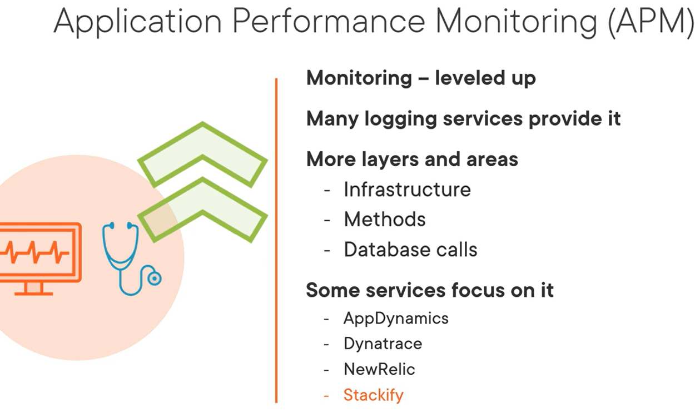

---
## Demo: Query-based alerts with Application Insight

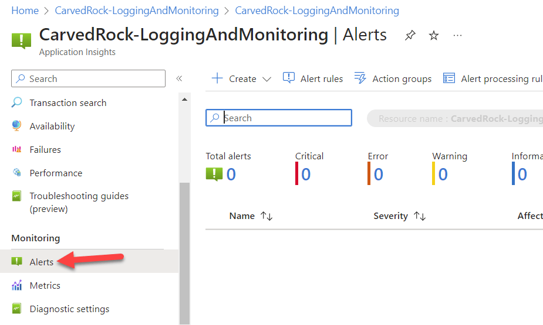

## Query-based Monitoring Examples

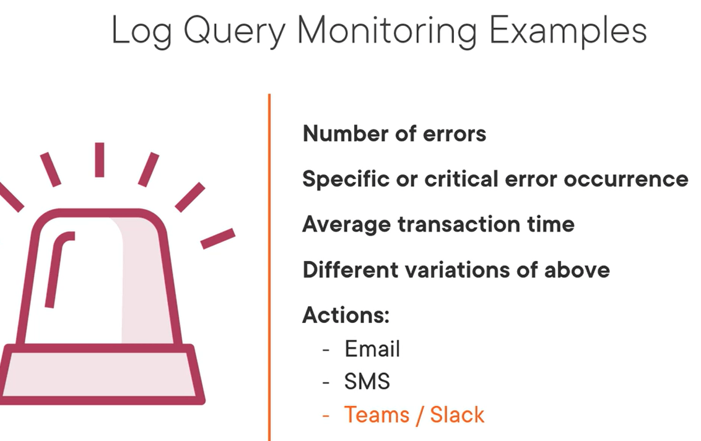

## Healthchecks

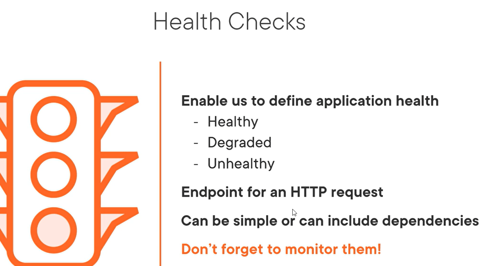

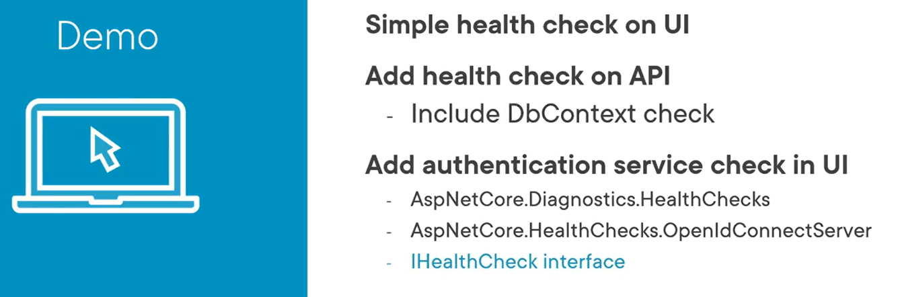

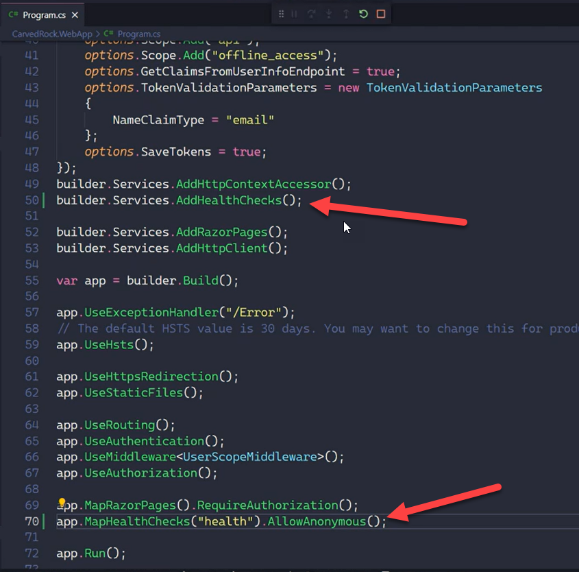

Healthcheck for DBContext

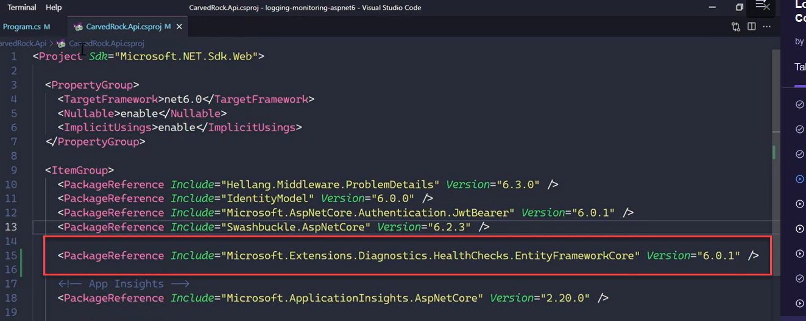

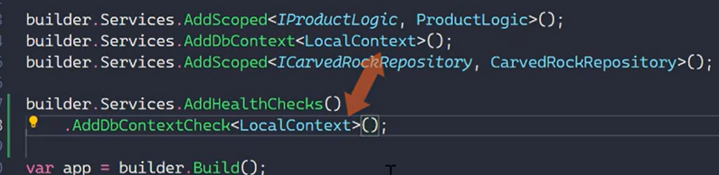

### Custom Healthcheck

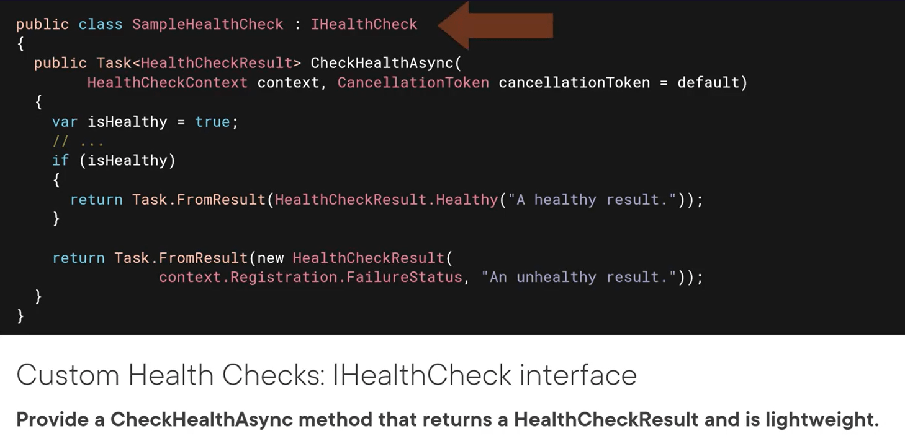

>For IDP healthcheck

```csharp
<PackageReference Include="AspNetCore.HealthChecks.OpenIdConnectServer" Version="6.0.1" />
```

```csharp
builder.Services.AddHealthChecks()
    .AddIdentityServer(new Uri("https://demo.duendesoftware.com"), failureStatus: HealthStatus.Degraded);
```

### Monitoring HC AppInsight

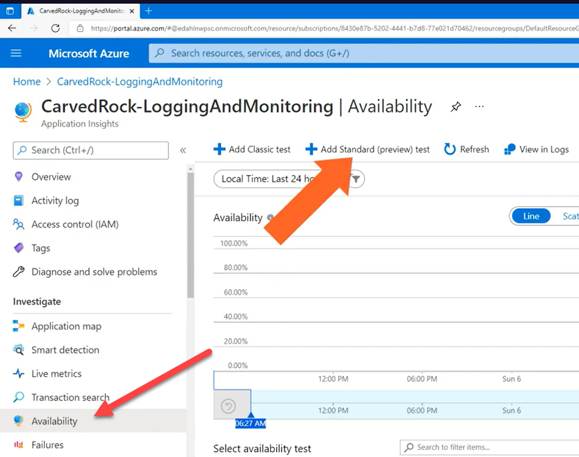

host.docker.internal special dns for docker dns (seq)
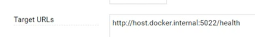

## Liveness and REadiness

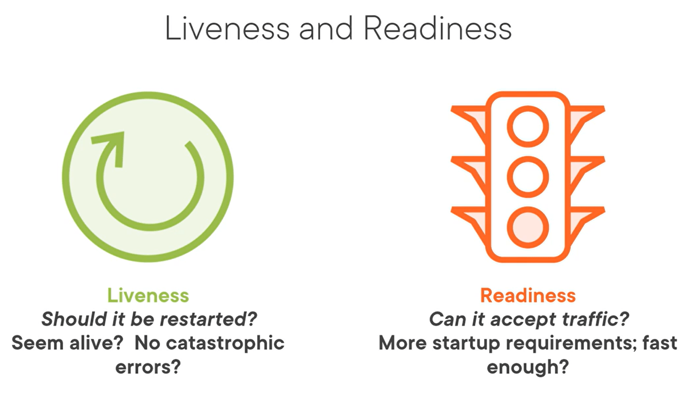

More on HC
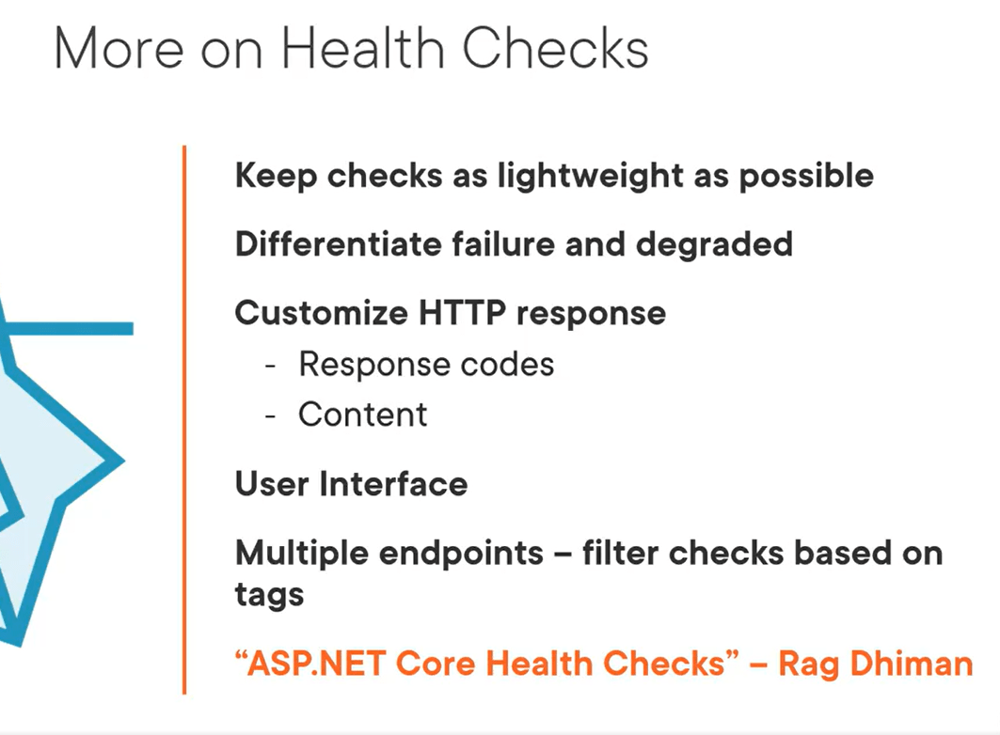

## Summary

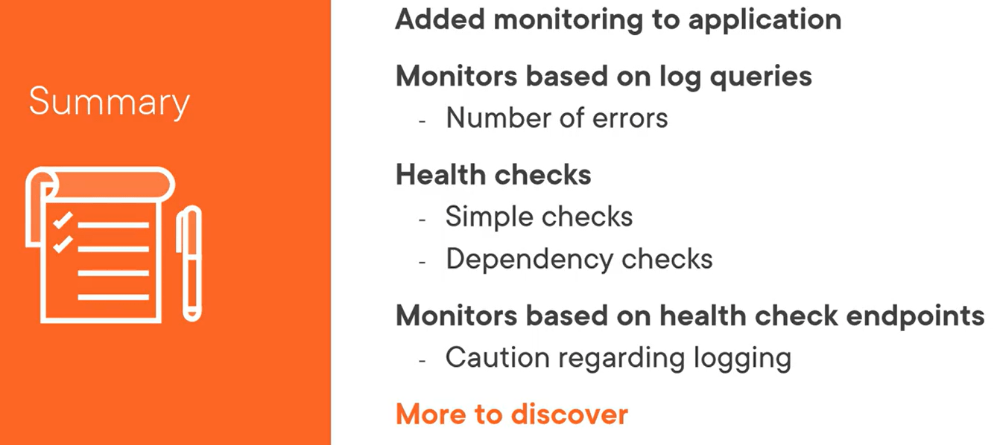


